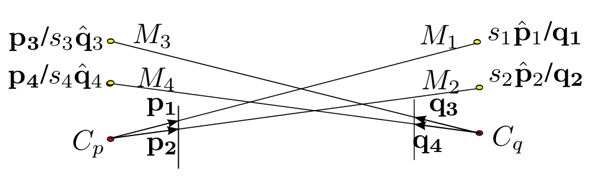

Example
=======

Here we describe how to use the important functions of the library. If you
just want to repeat the experiments, please jump to experiments
section :ref:`experiments`.

Terminology
-----------

.. math::
   \newcommand{\vect}[1]{\mathbf{#1}}
   \newcommand{\hvect}[1]{\bar{\vect{#1}}}
   \newcommand{\uvect}[1]{\hat{\vect{#1}}}
   \newcommand{\field}[1]{\mathbb{#1}}

   Simplified diagram for the two-camera problem. Assuming the length
   of respective rays to be :math:`s_1, s_2, s_3, s_4` respectively, each marker
   coordinates can be written in both coordinate frames :math:`\{p\}` and :math:`\{q\}`. For
   example :math:`M_1` is :math:`s_1\uvect{p}_1` in frame :math:`\{p\}` and :math:`\vect{q_1}` in
   :math:`\{q\}`, where :math:`\uvect{p}_1` unit vector parallel to :math:`\vect{p}_1`. 

We have used the variable names `frame1scaled` and `frame2scaled` repeatedly
in the code. In the above configuration frame1scaled will be a list of pairs of
marker positions that have "scaled" positions in frame "1". If :math:`\{p\}` is
assumed to be the frame "1" than frame1scaled will be
[(:math:`s_1\uvect{p}_1`, :math:`\vect{q}_1`), (:math:`s_1\uvect{p}_2`, :math:`\vect{q}_2`)]

Note that the markers :math:`M_1, M_2` are "scaled" in frame 1.

Similarly the `frame2scaled` represents the rest of the marker position pairs.
[(:math:`\vect{p}_3`, :math:`s_3\uvect{q}_3`), (:math:`\vect{p}_4`, :math:`s_4\uvect{q}_4`)]

From coordinates with scale ambiguity to rotation translation.
--------------------------------------------------------------

This example will walk through computing :math:`R, t` from :math:`[(\vect{p}_1, \uvect{q}_1), (\vect{p}_2, \uvect{q}_2), (\uvect{p}_3, \vect{q}_3), (\uvect{p}_4, \vect{q}_4)]`

Since the polynomials to be solved are too complicated to be solved by hand
and we have different polynomials for different distributions of markers over
the robots. This is why we use symbolic mathematics package ``sympy`` to
generate the multi-variate polynomials, eleminating scale varibles to get
single variable polynomials.

Assuming that you have reached the point where you have normalized vectors as
shown in the diagram above. The following code will help you compute the scale
factors (:math:`s_1, s_2, s_3, s_4`).

.. highlight: python

Let us create an test case. The test case is implemented in
``mutloc.test.test_pose_computation``. We will try to walk you through the
test case. Suppose there are two marker per camera and the arrangement of
markers is same.::
        
    # Set the absolute position of markers
    # M_1, M_2 are fixed on robot L
    markersL = [np.array(p) for p in [(-.1, -.1, .3), (.1, -.1, .3)]]
    # M_3, M_4 are fixed on robot R
    markersR = [np.array(p) for p in [(-.1, -.1, .3), (.1, -.1, .3)]]

Next we choose a random transform between the two robots. We choose a random
rotation without any constraints and set translation between 0.7 units and 10
units. Note that minimum translation is set to twice the euclidean distance of
he markers considering the arguments given in section III C of the paper;
otherwise in a certain rotation configuration the marker of the other robot
can be nearer robot's own markers.::

    # Choose a random rotation
    quaternion = [random.random() for i in range(4)]
    mag = math.sqrt(sum([x**2 for x in quaternion]))
    quaternion = [x/mag for x in quaternion]

    # Random translation with minimum more than twise the euclidean
    # distance of the markers.
    translation = [random.uniform(.7, 10) for i in range(3)]

Compute the coordinates of :math:`M_1, M_2` in frame 2 and :math:`M_3, M_4` in
frame 1. These computed coordinates will be normalized to unit vector to
simulate perspective projection.  ::

    # Christoph Gohlke's transformations.py (included)
    import transformations as tf
    import mutloc.utils as utils

    # Convert to a transform matrix
    import transformations as tf 
    T = tf.quaternion_matrix(quaternion)
    T[:3, 3] = translation

    # compute the marker positions in the other coordinate frame
    # M_3 and M_4 in coordinate frame L
    Tinv = utils.transform_inv(T)
    frame1scaled = [(utils.apply_transform(Tinv, pR), pR)
                    for pR in markersR]

    # M_1 and M_2 in coordinate frame R
    frame2scaled = [(pL, utils.apply_transform(T, pL))
                    for pL in markersL]

    # Normalize computed coordinates to unit vector in order to
    # simulate perspective projection
    frame1scaled = [(p1 / np.linalg.norm(p1), p2) for p1, p2 in frame1scaled]
    frame2scaled = [(p1, p2 / np.linalg.norm(p2)) for p1, p2 in frame2scaled]

Now we feed these arguments to our method
``mutloc.core.solve_mutual_localization``::
    
    Tgot_roots = corr.solve_mutual_localization(frame1scaled, frame2scaled, tol=TOL)

Their may be multiple roots, but most of low noise situations have only one
root as the roots have already been filtered and sorted by error. The first
root is the most likely transformation. We can check that this transformation
is what we expected.::

    
    self.assertTrue(
        np.allclose(Tgot_roots[0], T, atol=TOL),
        "Got {0} expected {1}".format(Tgot_roots[0], T))
